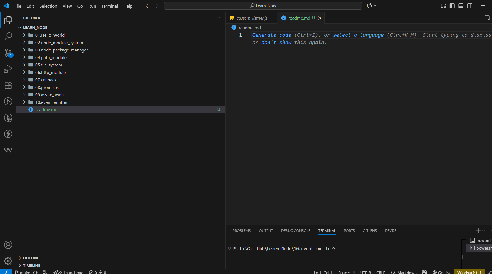

# Node_Fundemant 🚀

A collection of fundamental Node.js concepts, examples, and practices.  
This repository is aimed at helping beginners (and myself) understand the **core building blocks of Node.js** in a simple and practical way.

---

## 📌 Features
- Basic Node.js setup and structure
- Working with **modules** and **exports**
- File System (`fs`) usage
- Handling **HTTP requests & responses**
- Understanding **EventEmitter**
- Using **NPM packages**
- Async programming with **Callbacks, Promises, and Async/Await**

---

## 📂 Project Structure

- modules/ # Node.js modules examples
- events/ # EventEmitter examples
- fs/ # File system operations
- http/ # HTTP server examples
- package.json # Project dependencies
- index.js # Entry point


---

## ⚡ Getting Started

###  Clone the Repository
```bash
git clone https://github.com/your-username/Node_Fundemant.git
```


---

## ⚡ Getting Started

### 1. Clone the Repository
```bash
git clone https://github.com/your-username/Node_Fundemant.git


```
## 📸 Screenshot

Here’s a quick look at the project:




